# Pipeline Performance Benchmark Report

**Model Used for Core Detection:** `yolov8n_int8_openvino_model`
**Total Execution Time:** 9.79 seconds

## Performance Metrics

| Metric | Measured Value | Unit | Target / Goal |
| :--- | :--- | :--- | :--- |
| **Detection Throughput** | 26.97 | FPS | Higher is better (>30) |
| **Tracking Overhead** | 9.55 | ms/frame | Lower is better (<10) |
| **Redis Write Latency** | 14.52 | ms | Lower is better (<5) |
| **VLM Captioning Time** | 0.36 | seconds | Lower is better |
| **LLM Reasoning Time** | 0.56 | seconds | Lower is better |
| **Total End-to-End Latency** | 97.74 | ms per event | Real-time efficiency |
| **Peak RAM Usage** | 393.40 | MB | Resource boundary check |

## Timeline Chart

```mermaid
gantt
    title Component Pipeline Relative Latency Breakup
    dateFormat  X
    axisFormat %s
    section Main Pipeline
    Detection Engine (ms)      :active, 0, 37
    Tracking Engine (ms)       : 37, 47
    Database Sync (ms)         : 47, 61
    section Heavy Processing
    VLM Ingestion (ms)         : 61, 418
    LLM Context Inference (ms) : 418, 976
```

