# Pipeline Performance Benchmark Report

**Model Used for Core Detection:** `yolov8n_int8_openvino_model`
**Total Execution Time:** 8.34 seconds

## Performance Metrics

| Metric | Measured Value | Unit | Target / Goal |
| :--- | :--- | :--- | :--- |
| **Detection Throughput** | 50.48 | FPS | Higher is better (>30) |
| **Tracking Overhead** | 12.34 | ms/frame | Lower is better (<10) |
| **Redis Write Latency** | 14.18 | ms | Lower is better (<5) |
| **VLM Captioning Time** | 0.36 | seconds | Lower is better |
| **LLM Reasoning Time** | 0.56 | seconds | Lower is better |
| **Total End-to-End Latency** | 83.27 | ms per event | Real-time efficiency |
| **Peak RAM Usage** | 392.75 | MB | Resource boundary check |

```mermaid
gantt
    title Component Pipeline Relative Latency Breakup
    dateFormat  X
    axisFormat %s
    section Main Pipeline
    Detection Engine (ms)     :active, 0, 15
    Tracking Engine (ms)       : 15, 19
    Database Sync (ms)         : 19, 21
    section Heavy Processing
    VLM Ingestion (ms)         : 21, 371
    LLM Context Inference (ms) : 371, 921
```

